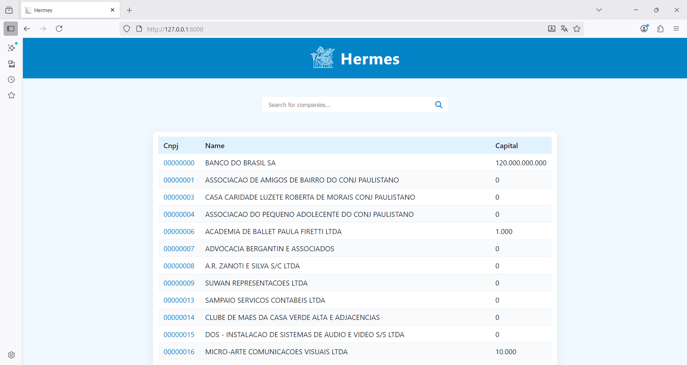
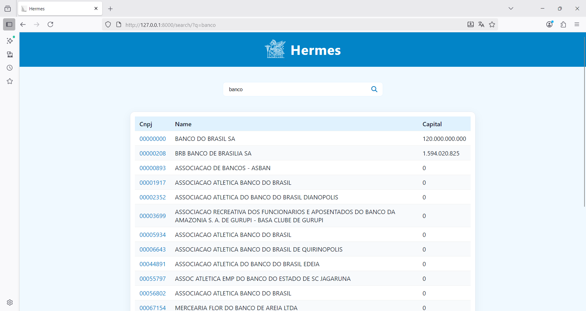
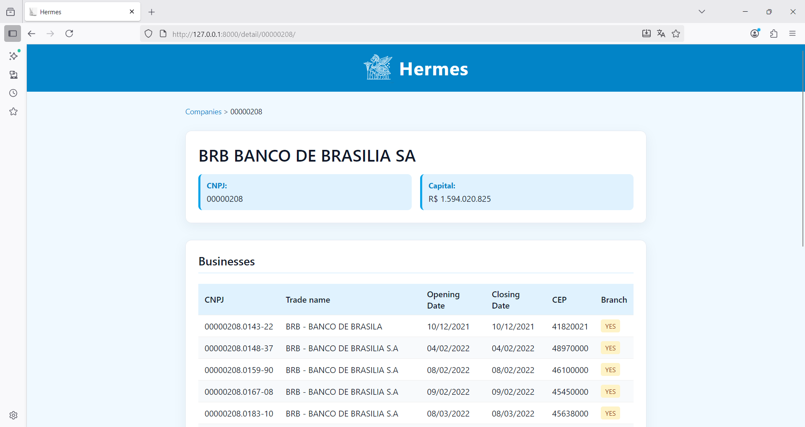

# Company shareholder based clustering

Clustering companies by mapping shared ownership and stakeholder relationships.

## Data Processing

### ETL Process

The project includes an ETL pipeline for processing data from the Brazilian Federal Revenue Service (Receita Federal). The pipeline is implemented in the `scripts/` directory:

- **Extract**: Data ingestion from original sources (`1_ingestion.py`)
- **Transform**: Data cleaning and transformation (`2_transform.py`)
- **Load**: Loading processed data into SQLite database (`3_load_sqlite.py`)

The ETL process is tested in the `tests/` directory, ensuring data integrity and proper transformation. For more detailed information about the data sources and processing steps, please refer to `data/README.md`.

## Hermes Project

### Companies App

The Hermes project includes a Django application called "companies" that provides a web interface for querying and exploring company data:

#### List View
The main page displays a paginated list of companies, allowing users to browse through all registered companies in the database.

#### Search View
The search functionality allows users to find specific companies by CNPJ (Brazilian company registration number) or corporate name.

#### Detail View
The detail view provides comprehensive information about a specific company, including its business activities and partners/shareholders.

## References

### Django

Harry J. W. Percival. **Test-Driven Development with Python**. O’Reilly Media, 3rd ed., 2025.

Geek University. **Programação Web com Python e Django Framework: Essencial**. Udemy.

Luiz Otávio Miranda. **Curso de Django Web Framework e Django Rest Framework (DRF)**. Udemy.

Django Documentation: <https://docs.djangoproject.com/>

### SQLite

SQLite Tutorial: <https://www.sqlitetutorial.net/>
